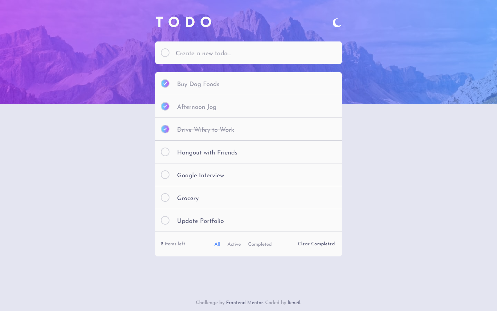

# Frontend Mentor - Todo app solution

This is a solution to the [Todo app challenge on Frontend Mentor](https://www.frontendmentor.io/challenges/todo-app-Su1_KokOW). Frontend Mentor challenges help you improve your coding skills by building realistic projects. 

## Table of contents

- [Overview](#overview)
  - [The challenge](#the-challenge)
  - [Screenshot](#screenshot)
  - [Links](#links)
- [My process](#my-process)
  - [Built with](#built-with)
  - [What I learned](#what-i-learned)
  - [Useful resources](#useful-resources)

## Overview

### The challenge

Users should be able to:

- View the optimal layout for the app depending on their device's screen size
- See hover states for all interactive elements on the page
- Add new todos to the list
- Mark todos as complete
- Delete todos from the list
- Filter by all/active/complete todos
- Clear all completed todos
- Toggle light and dark mode
- **Bonus**: Drag and drop to reorder items on the list

### Screenshot

### Links

- [Solution URL](https://www.frontendmentor.io/solutions/todo-app-DasDncVbYO)
- [Live Site URL](https://njvs.github.io/Todo-app/)

## My process

### Built with

- Semantic HTML5 markup
- CSS custom properties
- Flexbox
- CSS Grid
- [React](https://reactjs.org/) - JS library
- [Styled Components](https://styled-components.com/) - For styles
- [Firebase](https://firebase.google.com) - Database

### What I learned

After a couple of months of playing with React, this is my first project using it. I picked this challenge because I think this is a very good project to familiarize myself with the basics and react hooks. I save todos in Firebase real-time database because I just want to see how the backend/RestAPI work. And for styling, I use styled-components because I'm not a fan of CSS-in-JS or CSS modules. I didn't add the drag and drop feature for now because I can't find a way to reorder data from the server without deleting the entire set of data and re-uploading the updated set of data. If someday I find a solution to this, I'll add it to this project.

### Useful resources

- [ReactJS Documentation](https://reactjs.org/docs/getting-started.html)
- [styled-components Docs](https://styled-components.com/docs)
- [Javascript.info](https://javascript.info)
- [Firebase Documentation](https://firebase.google.com/docs)